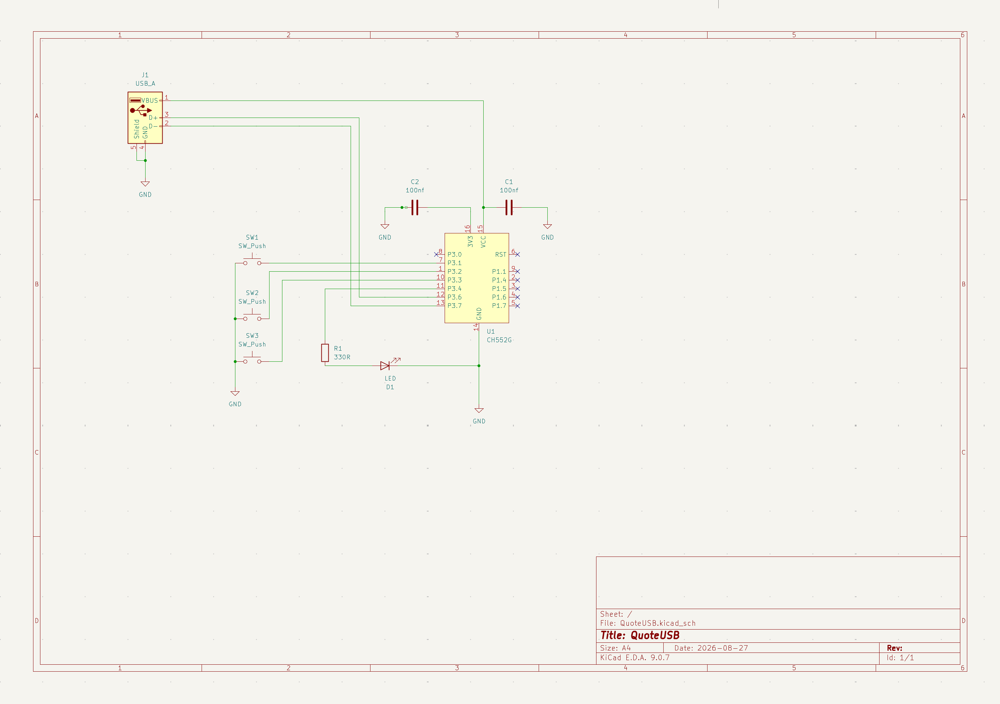
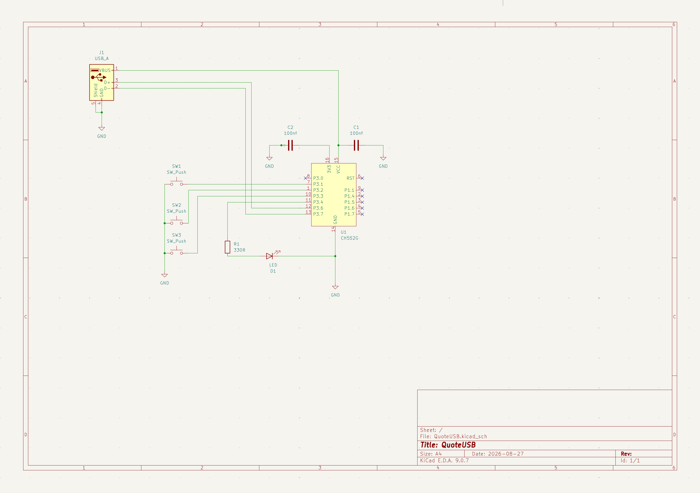
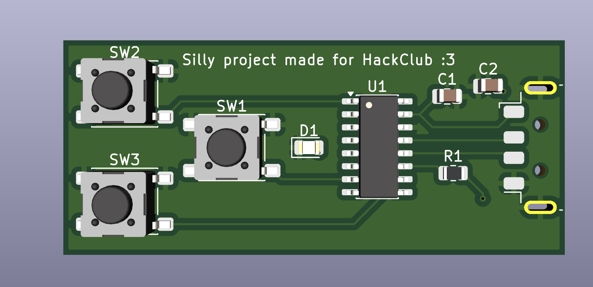
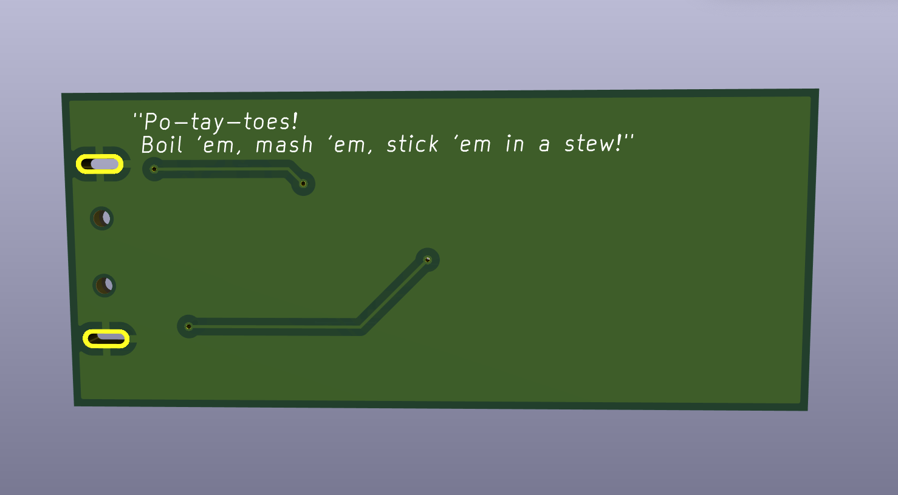
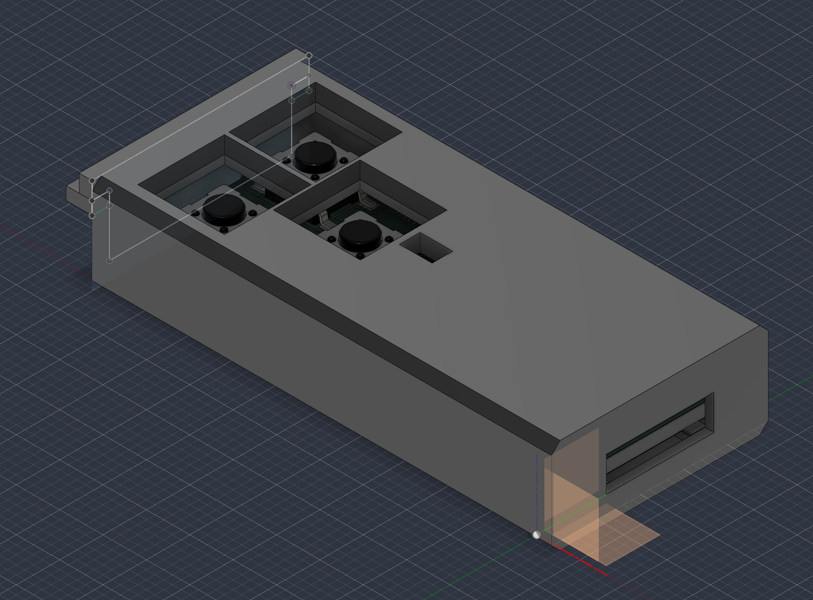

# Journal

**Project name**: QuoteUSB
A small 3-button USB MacroPad built for HackClub as a hardware experiment with the CH552G microcontroller

**Total hours:** 20.5

#### August 26: Learning time
Time spent: 2 hours
I began to get used to KiCad, reading guides online, learning how it works and how to use it.

#### August 27: Development
*Time Spent: 5 hours*
Started the project by creating the project for ATtiny85 because I stabled upon it online, and it seemed pretty easy to use, but then after a suggestion from another hackclubber I switched to CH552G.
Having 12 more hours to finish the project I decided to expand the project a bit, putting 3 buttons and 1 LED instead of 2 buttons.

*Time Spent: 3 hours*
I moved to PCB Editor in KiCad. Arranged the 3 switches, status LED, and USB-A PCB trace connector to fit a tight form factor. Carefully routed all trace lines, ensuring clean USB differential signals and a solid GND plane.
After running the DRC I had a few problems arranging the position of capacitors and resistors, but I made it and after completing the DRC with no errors I generated the initial 3D STEP models.

*Time Spent: 4 hours*
Started working on the firmware on Arduino IDE to let the QuoteUSB print a random motivational quote when one button is pressed, an ironic/sharp one when the second button is pressed and a macro with the last one.
I ran into compilation issues with the ch55xduino core due to missing libraries and RAM settings. Resolved the issue and programmed the 3 inputs.

*Time Spent: 6.5 hours*
Started using Autodesk Fusion for the first time and after a lot of time fighting with the program I managed to design the case for the PCB.

